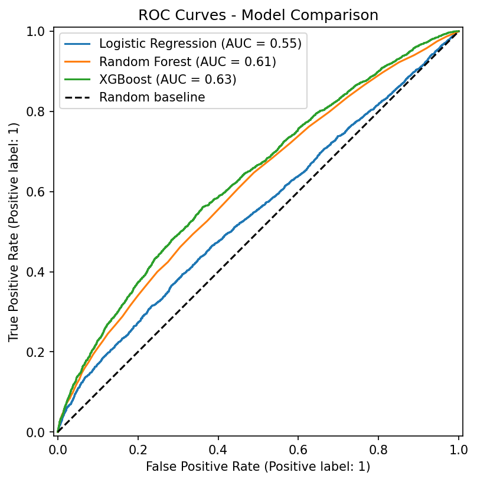
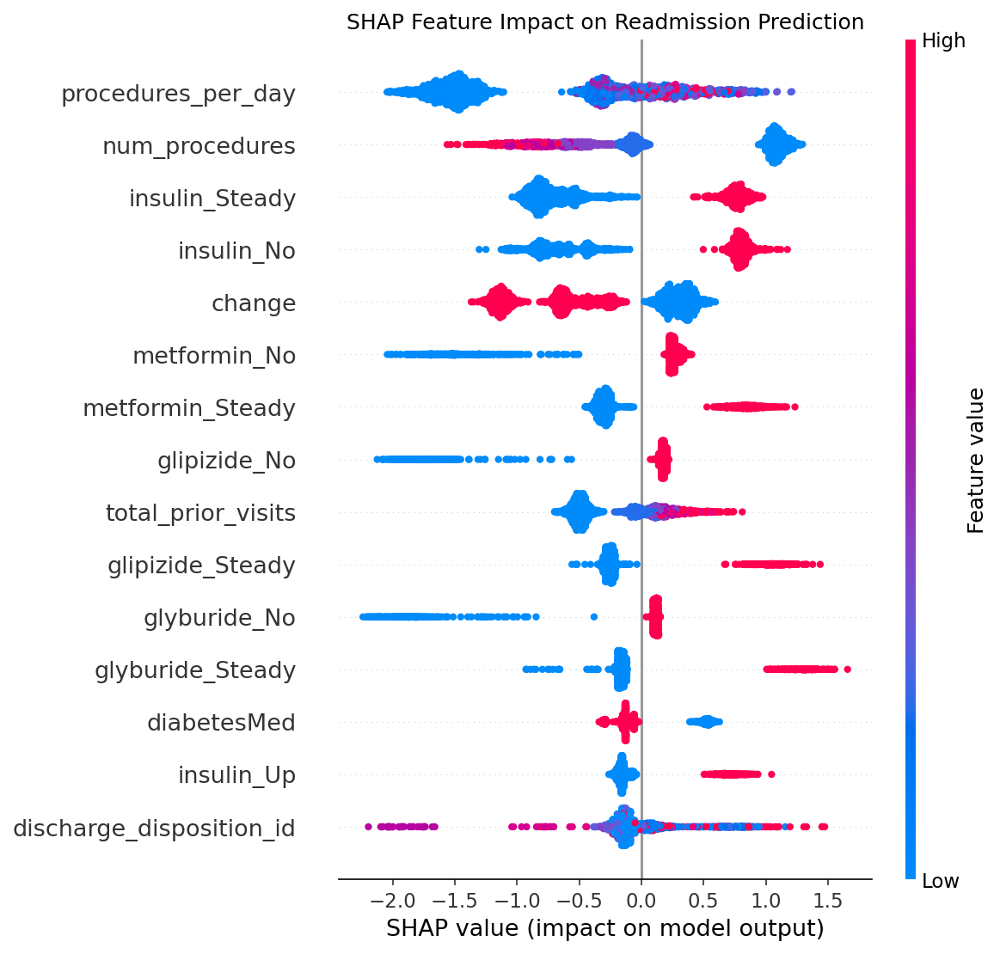

# 🏥 Hospital Readmission Risk Predictor

[](https://readmission-risk-muntazir.streamlit.app)

A machine learning project that predicts whether a diabetic patient will be readmitted to hospital within 30 days of discharge. Built as a personal data science portfolio project demonstrating an end-to-end ML pipeline from raw data to deployed interactive application.

---

## Live Demo

**[→ Open the app](https://readmission-risk-muntazir.streamlit.app/)**


---

## Project Structure

```
hospital-readmission-project/
├── .streamlit/
│   └── config.toml                # Dark theme + server config
├── data/
│   ├── diabetic_data.csv          # Raw dataset (UCI)
│   ├── IDs_mapping.csv            # ID reference file
│   └── cleaned_data.csv           # Processed dataset used for modelling
├── notebooks/
│   ├── 01_eda.ipynb
│   ├── 02_feature_engineering.ipynb
│   ├── 03_modelling.ipynb
│   └── 04_shap_analysis.ipynb
├── images/
│   ├── readmission_distribution.png
│   ├── feature_distributions.png
│   ├── roc_curves.png
│   ├── shap_bar.png
│   └── shap_dot.png
├── models/
│   ├── xgboost_model.pkl          # Trained XGBoost classifier
│   └── feature_names.pkl          # 53-feature list used during training
├── app.py                         # Streamlit web application
├── requirements.txt               # Pinned dependencies (Python 3.11)
└── README.md
```

---

## Dataset

**Diabetes 130-US Hospitals (1999–2008)**
- 101,766 patient records
- 50 features including demographics, diagnoses, medications, and lab results
- Source: UCI Machine Learning Repository via Kaggle
- Target: readmitted within 30 days (binary classification)

---

## Approach

**Feature Engineering** — four derived features not in the raw data:
- `meds_per_day` — medication count relative to length of stay
- `procedures_per_day` — procedural burden normalised by stay duration
- `total_prior_visits` — combined outpatient, emergency, and inpatient history
- `lab_per_day` — diagnostic intensity relative to stay length

**Model Comparison** (SMOTE-balanced training):

| Model | AUC-ROC |
|---|---|
| XGBoost | 0.6325 |
| Random Forest | 0.6135 |
| Logistic Regression | 0.5472 |

Results are consistent with published benchmarks on this dataset (0.62–0.68 AUC).

**Interpretability** — SHAP waterfall charts explain every individual prediction in the app.

---

## App Screenshots




---

## Deployment

### Streamlit Community Cloud 

See full step-by-step instructions below.

### Local

```bash
git clone https://github.com/MuntazirAliM/hospital-readmission-project.git
cd hospital-readmission-project
pip install -r requirements.txt
streamlit run app.py
```

---

## Tech Stack

- **Python 3.11** (Streamlit Cloud compatible)
- **pandas, NumPy** — data manipulation
- **scikit-learn** — modelling and evaluation
- **XGBoost** — gradient boosted classifier
- **imbalanced-learn** — SMOTE oversampling
- **SHAP** — model interpretability
- **Streamlit** — interactive web application
- **matplotlib, seaborn** — visualisation

---

## Author

**Muntazir Ali Mughal**
MSc Data Science — King's College London
muntaziralimughal6@gmail.com